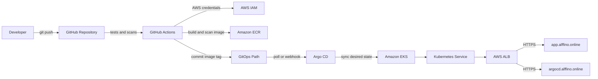

# Deploy a Python Application to AWS EKS Using GitOps

This repository contains a production-ready sample deployment for a Python
Hello World service on Amazon EKS using GitHub Actions, Amazon ECR, Argo CD,
Kustomize, and the AWS Load Balancer Controller.

The public application domain is `alffino.online`. The Argo CD UI domain is
`argocd.alffino.online`.

## Architecture



## Repository Layout

- `app/`: Flask application with health and readiness endpoints.
- `tests/`: Pytest coverage for the sample service.
- `Dockerfile`: Hardened non-root Gunicorn container image.
- `.github/workflows/ci.yml`: CI/CD workflow with DevSecOps gates.
- `terraform/`: EKS, VPC, Argo CD Helm release, and ECR infrastructure.
- `k8s/`: Kubernetes base manifests.
- `gitops/`: Argo CD watched Kustomize path.
- `argocd/`: Argo CD Application and UI ingress manifests.
- `scripts/`: Image promotion, rollback, suspend, and startup helpers.

## Deployment Workflow

1. Developer pushes to `main`.
2. GitHub Actions installs dependencies and runs unit tests.
3. Security gates run secret scanning, dependency scanning, IaC scanning, and
   container image scanning with Trivy/Gitleaks.
4. GitHub Actions authenticates with the configured AWS access-key secrets and
  pushes the image to Amazon ECR with the immutable Git SHA tag.
5. The pipeline commits the image repository and tag into `gitops/kustomization.yaml`.
6. Argo CD detects the GitOps change and syncs the workload to EKS.
7. The AWS Load Balancer Controller reconciles the ALB ingress for
   `app.alffino.online`.

## Required GitHub Secrets

- `AWS_ACCESS_KEY_ID`: IAM access key used by GitHub Actions.
- `AWS_SECRET_ACCESS_KEY`: IAM secret key paired with `AWS_ACCESS_KEY_ID`.
- The workflow reads the ECR repository URL directly from Terraform output
  `ecr_repository_url`; no `ECR_REPOSITORY` secret is required.
- `GITOPS_REPO`: GitOps repository in `OWNER/REPOSITORY` form or as a full HTTPS URL. This can be the same repo.
- `GITOPS_REPO_TOKEN`: Fine-scoped token allowed to push GitOps image updates. For a private repository, the token must have repository contents read/write permission.

See [docs/github-actions-oidc.md](docs/github-actions-oidc.md) for the AWS
credentials setup and the alternative OIDC trust policy.

## First-Time Setup

Terraform can create the ACM certificate, DNS validation record, and Route 53
hosted zone for `alffino.online`. When `create_route53_zone = true`, delegate
the nameservers shown by `terraform output route53_name_servers` at your domain
registrar. ACM validation and the ALB HTTPS listener cannot complete until that
delegation is active. The AWS Load Balancer Controller creates the ALB
automatically from the Kubernetes Ingress after the cluster and certificate
are ready.

Create the Terraform state backend once before initializing the main stack:

```bash
terraform -chdir=terraform/backend-bootstrap init
terraform -chdir=terraform/backend-bootstrap apply
terraform -chdir=terraform init -migrate-state
```

The bootstrap stack creates a versioned, AES256-encrypted S3 bucket with public
access blocked. The main stack uses native S3 lockfiles for state locking.

```bash
cd terraform
terraform init
terraform apply
```

Install or verify the AWS Load Balancer Controller after the cluster is ready.
The manifests assume the `alb` ingress class exists.

Apply Argo CD objects after replacing placeholders:

```bash
kubectl apply -f argocd/app.yaml
kubectl apply -f argocd/argocd-ingress.yaml
```

Replace these values before the first sync:

- `REPLACE_WITH_GITOPS_REPO` in `argocd/app.yaml`.

The `promote-and-verify` job validates these values before cloning. Configure the following repository secrets under GitHub **Settings > Secrets and variables > Actions**:

```text
AWS_ACCESS_KEY_ID
AWS_SECRET_ACCESS_KEY
GITOPS_REPO
GITOPS_REPO_TOKEN
```

Use `GITOPS_REPO` as either `OWNER/REPOSITORY` or `https://github.com/OWNER/REPOSITORY.git`. For this repository, set it to `Prashant260/Argo-CD-EKS-` and the workflow uses the built-in `GITHUB_TOKEN`, so `GITOPS_REPO_TOKEN` is not needed. External GitOps repositories require `GITOPS_REPO_TOKEN`. Do not include a token in the repository URL.

If promotion fails with HTTP `403`, the token does not have push permission for
the repository, or a branch protection rule blocks Actions pushes. Update the
fine-grained token with **Contents: Read and write** access to this repository,
or allow the workflow token to bypass the branch rule.

- `REPLACE_WITH_ECR_REPOSITORY` in `gitops/kustomization.yaml`.
- `REPLACE_WITH_APP_ACM_CERTIFICATE_ARN` in app ingress manifests.
- `REPLACE_WITH_ARGOCD_ACM_CERTIFICATE_ARN` in `argocd/argocd-ingress.yaml`.

## Destroy Infrastructure

The CI workflow includes a manual destroy action. In GitHub, open **Actions**,
select **CI/CD**, choose **Run workflow**, and enter exactly `DESTROY` in the
confirmation field. The workflow creates a Terraform destroy plan and applies
that plan using the remote S3 state. A normal push or pull request cannot run
the destroy job.

## SSL/TLS And DNS

Create ACM certificates in the same region as the ALB for:

- `app.alffino.online`
- `argocd.alffino.online`

Use DNS validation. Hand the ACM validation CNAME records to the DNS operator.
After the ALBs are created, provide these final DNS records:

- `app.alffino.online` CNAME or ALIAS to the application ALB DNS name.
- `argocd.alffino.online` CNAME or ALIAS to the shared/public ALB DNS name.

Both ingresses enforce HTTP to HTTPS redirects and use the TLS 1.2/1.3 ALB
security policy.

## Rollback

Preferred GitOps rollback:

```bash
git revert <gitops-image-update-commit>
git push
```

Emergency Kubernetes rollback:

```bash
kubectl rollout history deployment/alffino-python-hello -n alffino
scripts/rollback.sh
scripts/rollback.sh <revision>
```

Argo CD self-heal will eventually return the cluster to Git desired state, so
commit a GitOps rollback after any emergency cluster-level rollback.

## Suspend And Start For Cost Optimization

Suspend public access and application compute:

```bash
scripts/suspend-environment.sh
```

For deeper savings, scale the managed node group to zero after suspension:

```bash
aws eks update-nodegroup-config \
  --cluster-name argocd-eks \
  --nodegroup-name argocd-eks-nodes \
  --scaling-config minSize=0,maxSize=1,desiredSize=0
```

Start the environment:

```bash
aws eks update-nodegroup-config \
  --cluster-name argocd-eks \
  --nodegroup-name argocd-eks-nodes \
  --scaling-config minSize=1,maxSize=3,desiredSize=2

scripts/start-environment.sh
```

For non-production environments, Terraform defaults worker nodes to Spot
capacity and keeps ECR image retention to the most recent 20 images.

## Security Controls

- GitHub Actions uses AWS OIDC instead of long-lived AWS access keys.
- Tests must pass before image publication.
- Gitleaks scans for accidental secrets.
- Trivy scans dependencies, IaC, Kubernetes manifests, and container images.
- ECR scan-on-push and lifecycle retention are enabled.
- Pods run as non-root with privilege escalation disabled, all Linux
  capabilities dropped, seccomp runtime default, and read-only root filesystem.
- Readiness/liveness probes, resource limits, HPA, PDB, ClusterIP service, and
  ALB TLS termination are configured.
- Argo CD automated sync uses prune, self-heal, retry, and Git-backed rollback.
